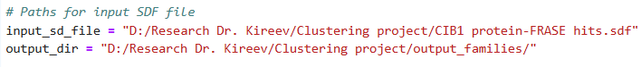
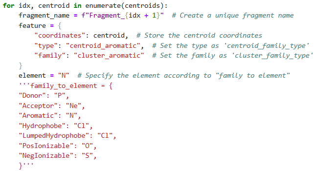
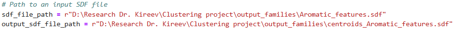
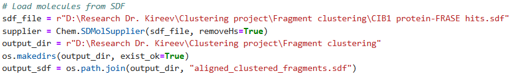
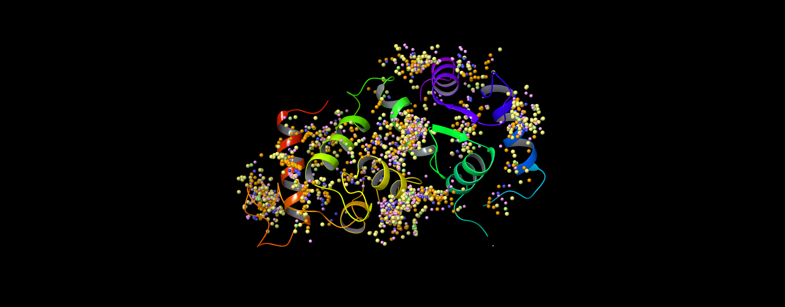
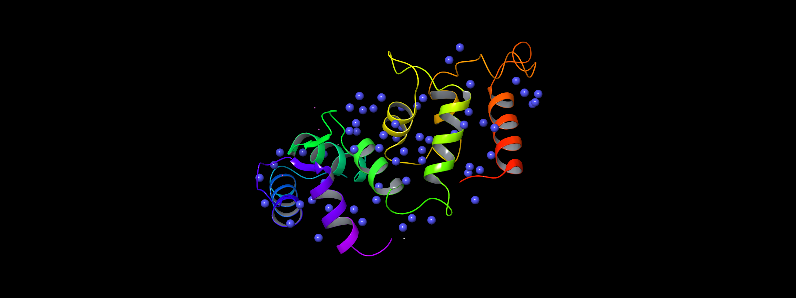
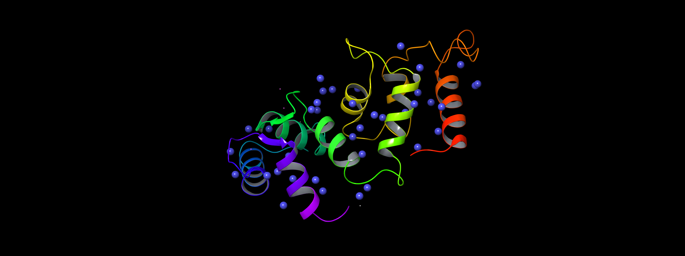
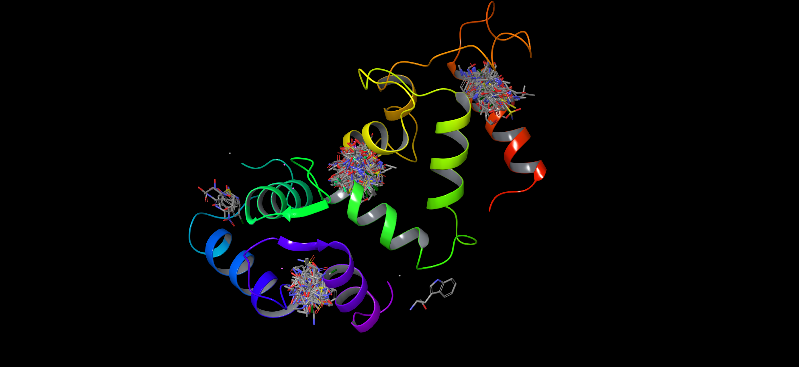

# Molecular Clustering Using RDKit Butina Module  

## Project Description  
This project provides Python code to cluster features and fragments of a given molecular structure.  

**Required Input:**  
A `.sdf` file containing molecular blocks with 3D coordinates.  

**Proposed Clustering Methods:**  
- **Feature Clustering (Including Singletons):** [`feature_clustering_1.py`](code/feature_clustering_1.py)  
- **Feature Clustering (Excluding Singletons):** [`feature_clustering_2.py`](code/feature_clustering_2.py)  
- **Fragment Clustering:** [`fragment_clustering.py`](code/fragment_clustering.py)  

---

## Necessary Code Modifications  
Certain modifications may be required to tailor the code to specific datasets.  

- **[`feature_generation.py`](code/feature_generation.py):**  
  *Modify as needed to generate relevant molecular features.*  
    

- **[`feature_clustering_1.py`](code/feature_clustering_1.py), [`feature_clustering_2.py`](feature_clustering_2.py):**  
  *Adjust clustering parameters based on molecular dataset requirements.*  
  
    

- **[`fragment_clustering.py`](code/fragment_clustering.py):**  
  *Modify input and output file locations.*  
    

---

## Code Results  
Below are the expected outputs from the scripts:  

- **Feature Generation (`feature_generation.py`):**  
    

- **Feature Clustering (Including Singletons) (`feature_clustering_1.py`):**  
    

- **Feature Clustering (Excluding Singletons) (`feature_clustering_2.py`):**  
    

- **Fragment Clustering (`fragment_clustering.py`):**  
    

---

## References  
- **Chemical Features in RDKit:** [RDKit Documentation](https://www.rdkit.org/docs/GettingStartedInPython.html#chemical-features-and-pharmacophores)  
- **Butina Clustering in RDKit:** [RDKit Butina Module](https://www.rdkit.org/docs/source/rdkit.ML.Cluster.Butina.html)  
- **Maestro Schrödinger:** [Schrödinger Maestro](https://www.schrodinger.com/platform/products/maestro/)  
